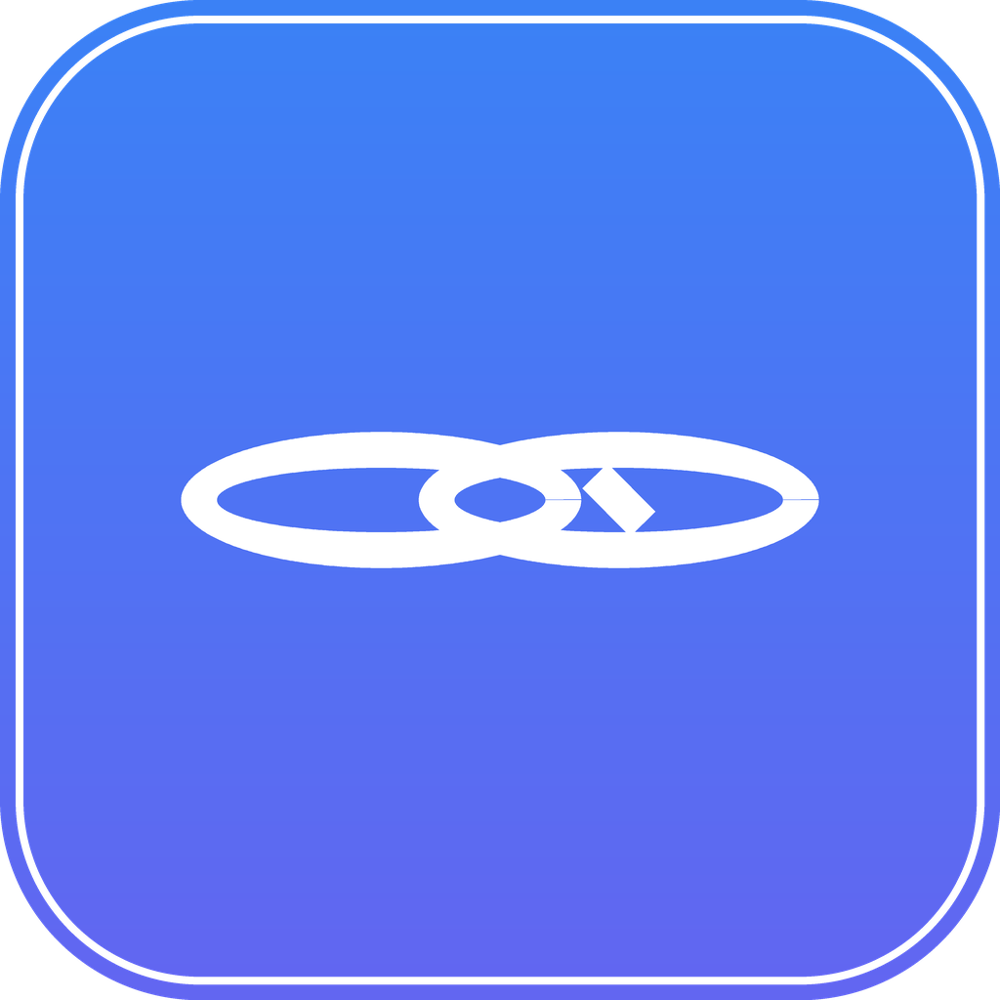

<p align="center">
  
</p>

<h1 align="center">LinkStrip</h1>

<p align="center">
  A privacy-first, minimalistic macOS menu-bar app that automatically removes tracking parameters from URLs copied to the clipboard.
</p>

<p align="center">
  <a href="LICENSE"></a>
  
  
</p>

---

## Features

- **Silent clipboard monitor** – sits in the menu bar and cleans links as soon as they are copied.
- **Redirect-link unwrapping** – extracts real destinations from click-tracking services like `link.fndrsp.net`.
- **Two independent toggles** – enable or disable cleaning for copied links and redirect links separately.
- **Local rule engine** – bundled `tracking-params.json`; no network calls, ever.
- **Editable rules** – add custom parameters, view the bundled defaults, or import/export your own JSON rule sets.
- **History** – keeps the last 100 cleaned URLs locally in `~/Library/Application Support/LinkStrip/history.json`.
- **Native notifications** – brief banner when a link is cleaned (toggle in preferences).
- **Launch at login** – uses `SMAppService` (requires a code-signed app bundle).
- **Sandboxed & offline** – zero outbound network requests, no analytics, no telemetry.

## Supported platforms

- macOS 13 Ventura and later
- Apple Silicon & Intel

## Screenshot

*Screenshot placeholder – replace `screenshot.png` in the repo root with an actual capture.*

## Default tracking parameters

The bundled rule file removes the following query parameters:

- `affiliate`
- `cmpid`
- `dclid`
- `emailLog`
- `fbclid`
- `feature`
- `gbraid`
- `gclid`
- `irclickid`
- `itm_campaign`, `itm_content`, `itm_medium`, `itm_source`, `itm_term`
- `mc_cid`
- `ocid`
- `ref_src`, `ref_url`
- `si`
- `trackingId`
- `trk`
- `ttclid`
- `utm_campaign`, `utm_content`, `utm_medium`, `utm_source`, `utm_term`
- `wbraid`
- `wickedid`

Add your own in **Preferences → Custom Tracking Parameters**.

## Install

Download the latest release from [GitHub Releases](https://github.com/StefanoGuerrini/LinkStrip/releases), drag `LinkStrip.app` to `/Applications`, and launch it.

Because the release builds are code-signed but notarized releases may still trigger Gatekeeper on first run, right-click the app and choose **Open** if macOS warns you.

## Build from source

Requires Xcode 15+ or the Swift 5.9+ toolchain on macOS 13+.

```bash
# Clone the repository
git clone https://github.com/StefanoGuerrini/LinkStrip.git
cd LinkStrip

# Debug build
make build

# Run tests
make test

# Build and package a release .app bundle (also regenerates the icon set)
make app
```

The release app is created at `.build/LinkStrip.app`. You can drag it to `/Applications`.

### Manual Swift Package Manager commands

```bash
swift build
swift test
swift build -c release
```

## Tests

The test suite lives in `Tests/LinkStripTests/` and covers the core `URLCleaner` engine:

- Removing single and multiple tracking parameters
- Preserving non-tracking query parameters
- Handling URLs that contain only tracking parameters
- Returning the original URL unchanged when no tracking parameters are present
- Rejecting malformed input
- Extracting and cleaning destinations from redirect/click-tracking links

Run tests with:

```bash
make test
```

## Version history

See [CHANGELOG.md](CHANGELOG.md) for release notes.

## Contributing

Contributions are welcome. See [CONTRIBUTING.md](CONTRIBUTING.md) for guidelines.

## Credits

- Created by [Stefano Guerrini](https://github.com/StefanoGuerrini)
- App icon and logo generated with Pillow
- MIT Licensed

## Privacy

- No network access is requested or performed.
- Clipboard contents are inspected locally and never transmitted.
- Only the original and cleaned URL are stored in the local history file.
- History is limited to the most recent 100 entries and can be cleared at any time.

## License

MIT License. See [LICENSE](LICENSE) for details.
